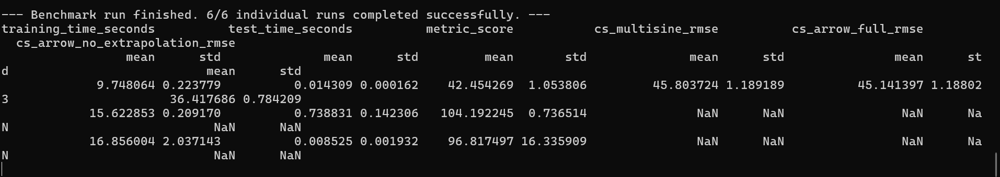
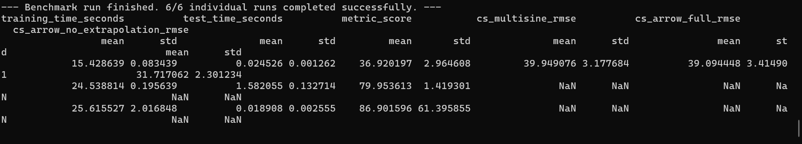
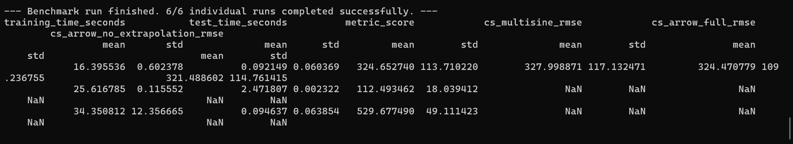

# System Identification Benchmark using IdentiBench

This project benchmarks multiple Mamba-based architectures for nonlinear system identification using the IdentiBench framework.

The goal is to compare training efficiency, prediction accuracy, stability, and generalization performance across different Mamba variants.

---

# 📌 Overview

We compare the following models:

- Mamba
- Mamba2
- Mamba3

These models are evaluated on standard nonlinear system identification benchmarks using repeated experiments.

---
# ⚙️ Setup

## 1. Clone the repository

```bash
git clone https://github.com/ARYANGAUATM001/sample-identibench.git
cd sample-identibench
```

## 2. Install dependencies

```bash
pip install -r requirements.txt
```

---

# ▶️ Running the Benchmark

Run the main script:

```bash
python main.py --model mamba1
python main.py --model mamba2
python main.py --model mamba3
```

This will:

1. Train the selected model
2. Run IdentiBench benchmarks
3. Repeat experiments multiple times
4. Output evaluation metrics

---

## 🧠 Models Implemented

### 🔹 1. Mamba

1. Lightweight baseline implementation
2. Fast training
3. Stable across repetitions
4. Efficient for simpler dynamics


### 🔹 2. Mamba2

1. Improved optimization and representation
2. Better accuracy on nonlinear systems
3. Lower benchmark error
4. Faster inference


###  3. Mamba3

1. Larger and more expressive variant
2. Higher computational cost
3. Stronger modeling capability
4. More complex dynamics handling

---

## 📊 Results and Comparison

Each benchmark is repeated **2 times** to ensure reliable results.
Metrics are reported as **mean ± standard deviation**.

---


## 📊 Results

### 🔹 Mamba Results


### 🔹 Mamba2 Results


###  Mamba3



## 🆚 Model Comparison


# 🆚 Model Comparison

## 1. Prediction Accuracy

### Mamba2

- Achieved the best overall benchmark performance
- Lower RMSE across nonlinear system benchmarks
- Better temporal sequence modeling capability

### Mamba

- Reliable baseline performance
- Performs well on moderate nonlinear dynamics
- Lower complexity and easier optimization

### Mamba3

- Higher model capacity
- Handles more complex representations
- Increased benchmark error in current experiments


---

## 2. Stability Across Runs

### Mamba1

- Most stable training behavior
- Lower variance across repeated experiments
- Consistent benchmark outputs

### Mamba2

- Good repeatability
- Stable convergence during training

### Mamba3

- Higher variance due to increased model complexity
- More sensitive to hyperparameter settings

---

## 3. Training Efficiency

### Mamba2

- Fastest benchmark execution
- Lower inference overhead
- Efficient training-performance tradeoff

### Mamba1

- Moderate computational cost
- Good efficiency for baseline experiments

### Mamba3

- Highest computational overhead
- Longer training duration
- Increased resource consumption

---


# 📌 Key Takeaways

- Mamba2 achieved the best overall balance between:
  - prediction accuracy
  - training efficiency
  - stability

- Mamba1 provides:
  - strong baseline performance
  - faster experimentation
  - lower computational requirements

- Mamba3 demonstrates:
  - larger representational capacity
  - higher computational complexity
  - need for further optimization

---

# 🧠 Interpretation of Results

- Lower `metric_score` indicates better benchmark performance
- Lower RMSE values correspond to improved prediction quality
- Smaller standard deviation indicates more stable training behavior

NaN values may appear because:

- Certain datasets do not compute specific metrics
- Some extrapolation benchmarks may not apply to all runs

---

# 🎯 Conclusion

This project demonstrates the effectiveness of Mamba-based architectures for nonlinear system identification using the IdentiBench framework.

Key observations:

- Mamba2 produced the strongest practical benchmark performance
- Mamba1 serves as an efficient lightweight baseline
- Mamba3 offers higher modeling capacity but requires additional optimization

The ideal model choice depends on:

- available computational resources
- required prediction accuracy
- target system complexity


