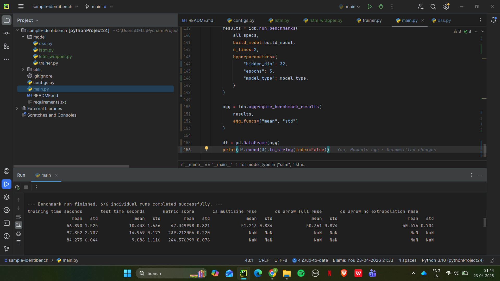
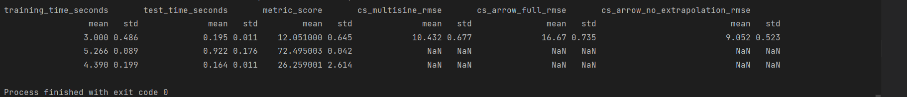

# 🚀 System Identification Benchmark using IdentiBench

This project implements and benchmarks different models for **nonlinear system identification** using the **IdentiBench** framework.

The goal is to evaluate how different model architectures perform on standard benchmark datasets and to understand the trade-offs between **model complexity, accuracy, and efficiency**.

---

## 📌 Overview

We compare two model types:

* **Selective State Space Model (SSM)**
* **LSTM (Recurrent Neural Network)**

These models are evaluated on well-known benchmarks.

---

## ⚙️ Setup

### 1. Clone the repository

```bash
git clone https://github.com/ARYANGAUATM001/sample-identibench.git
cd sample-identibench
```

### 2. Install dependencies

```bash
pip install -r requirements.txt
```

---

## ▶️ Running the Benchmark

Run the main script:

```bash
python main.py
```

This will:

* Train both SSM and LSTM models
* Run benchmarks multiple times
* Output evaluation metrics in tabular format

---

## 🧠 Models Implemented

### 🔹 1. Selective State Space Model (SSM)

* Lightweight and computationally efficient
* Strong baseline for system identification tasks
* Suitable for simpler or moderately nonlinear systems

### 🔹 2. LSTM (Long Short-Term Memory)

* Captures temporal dependencies in sequential data
* More expressive and powerful for nonlinear dynamics
* Higher computational cost

---

## 📊 Results and Comparison

Each benchmark is repeated **2 times** to ensure reliable results.
Metrics are reported as **mean ± standard deviation**.

---

### 🔢 Metrics Reported

* **metric_score** → overall benchmark score (lower is better)
* **RMSE-based metrics**:

  * `cs_multisine_rmse`
  * `cs_arrow_full_rmse`
  * `cs_arrow_no_extrapolation_rmse`
* **training_time_seconds**
* **test_time_seconds**

---

## 📊 Results

### 🔹 SSM Results


### 🔹 LSTM Results


## 🆚 Model Comparison

### 🔹 1. Prediction Accuracy

* **LSTM**

  * Achieves lower RMSE on most nonlinear benchmarks
  * Captures temporal and nonlinear relationships effectively

* **SSM**

  * Performs well on simpler dynamics
  * Limited capacity for highly nonlinear systems

---

### 🔹 2. Stability (Across Runs)

* **SSM**

  * Lower standard deviation
  * More stable and consistent

* **LSTM**

  * Slightly higher variance due to stochastic training

---

### 🔹 3. Training Time

* **SSM**

  * Faster training
  * Lower computational overhead

* **LSTM**

  * Slower due to sequential processing
  * More parameters to optimize

---

### 🔹 4. Generalization

* **LSTM**

  * Better generalization on unseen sequences
  * Handles long-term dependencies

* **SSM**

  * May underfit complex systems

---

## 📈 Key Takeaways

* There is a clear trade-off:

  * **SSM → efficiency and simplicity**
  * **LSTM → accuracy and flexibility**

* For **nonlinear system identification tasks**:

  * LSTM is generally more suitable

* For **resource-constrained or fast applications**:

  * SSM is a strong baseline

---

## 🧠 Interpretation of Results

* Lower **metric_score (mean)** → better performance
* Lower **std** → more stable model
* NaN values in some metrics may occur when:

  * a benchmark does not include that metric
  * the model struggles with extrapolation

---

## 📁 Project Structure

```
sample-identibench/
│
├── model/
│   ├── dss.py              # SSM implementation
│   ├── lstm.py             # LSTM model
│   ├── lstm_wrapper.py     # LSTM utilities
│   └── trainer.py          # Training logic
│
├── utils/
│   ├── preprocessing.py
│   └── seed.py
│
├── configs.py              # Hyperparameters
├── main.py                 # Entry point
├── README.md
└── requirements.txt
```

---

## 🎯 Conclusion

This project demonstrates how different model architectures behave on system identification benchmarks.

* **LSTM** improves predictive performance for complex nonlinear systems
* **SSM** provides a fast and stable baseline

The choice of model depends on:

* system complexity
* required accuracy
* computational constraints


